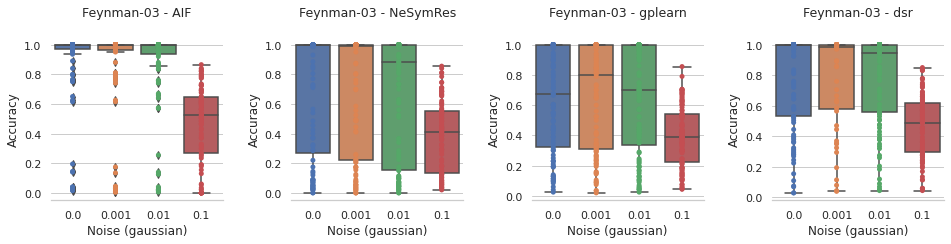
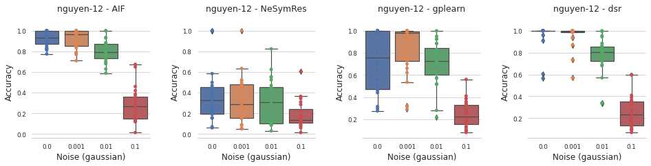

## A Comparative Study on Machine Learning Algorithms for Knowledge Discovery

This repository is the official implementation of **"A Comparative Study on Machine Learning Algorithms for Knowledge Discovery."**

> :rocket: **Update:** The paper has been accepted for 17th International Conference on Control, Automation, Robotics and Vision (ICARCV 2022).

### **A. Requirements**

-   Install [miniconda](https://docs.conda.io/en/main/miniconda.html) to manage experiments' dependencies.

To install requirements:

```bash

conda env create -f environment.yml

```

### **B. Datasets**

1. _Feynman-03:_ All equations with up to 3 input variables from the AI-Feynman dataset were sampled. The resulting dataset contained 52 equations.

2. _Nguyen-12:_ The datasets consisted of 12 equations with a maximum of 2 input variables. It is important to highlight that few equations contain terms such as x^6 and x^5 which were included to test the methods’ ability to understand high-frequency terms.

### **C. Baselines**

1. _Genetic programming (GPL)_: A python library called gplearn was used to perform genetic programming (GP).

2. _Deep symbolic regression (DSR)_: An auto-regressive approach based on reinforcement learning search to optimize the symbolic search space. The opensource implementation of (Petersen et. el.) with default parameters was used for the benchmark tasks.

3. _AIFeynman (AIF)_: A heuristic based search approach that uses recurring patterns in symbolic formulas describing natural phenomena. A custom wrapper was written around the open-source python package, AIFeynman, for the evaluation.

4. _Neural Symbolic Regression that Scales (NeSymRes)_: A symbolic language modelling approach that was pretrained on a large distribution of millions of equations. The pretrained model on 100 million equations was used for the benchmark.

### **D. Benchmark**

The baseline models can be benchmarked using the following command and arguments:

-   Models: `gpl`, `dsr`, `aif`, `nesymres`
-   Datasets: `feynman`, `nguyen`

```bash
make <DATASET-NAME>-<MODEL-NAME> noise=<NOISE-LEVEL> num_points=<NUM-POINTS>
```

For example, to run the benchmark for the `gpl` model on the `feynman` dataset with `noise=0.1` and `num_points=1000`, run:

```bash

make feynman-gpl noise=0.1 num_points=1000

```

### **E. Results**

<p align="center">
    <br/>
    <em>Figure 1: Effect of noise on accuracy in Feynman-03 dataset</em>    
</p>

<p align="center">
    <br/>
    <em>Figure 2: Effect of noise on accuracy in Nguyen-12 dataset</em>
</p>

Other results can be found in the **results and discussion** section of the paper.

### **F. Citation**

If you find this work useful in your research, please consider citing:

```
@inproceedings{,
  title={A Comparative Study on Machine Learning Algorithms for Knowledge Discovery},
  author={Siddesh Sambasivam Suseela, Yang Feng, Kezhi Mao},
  booktitle={},
  year={2022},
  organization={}
}
```

### **G. Contact**

For any questions, please contact Siddesh Sambasivam Suseela (siddeshsambasivam.official@gmail.com)
